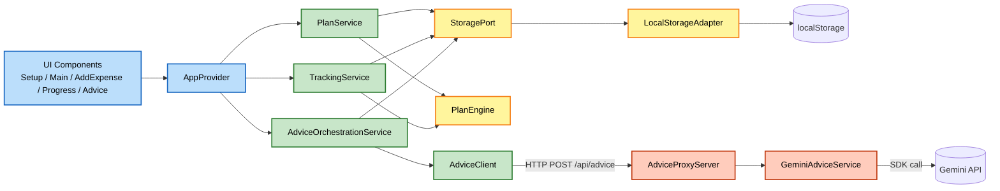

# Component Dependencies — Rollover

## Dependency Matrix

| Component | Depends On | Layer |
|---|---|---|
| `Models` (types) | — | Core |
| `PlanEngine` | `Models` | Core |
| `StoragePort` | `Models` | Core |
| `LocalStorageAdapter` | `StoragePort`, `Models`, `window.localStorage` | Core |
| `AppProvider` | `LocalStorageAdapter`, `PlanService`, `TrackingService`, `AdviceOrchestrationService` | App |
| `PlanService` | `StoragePort`, `PlanEngine` | App |
| `TrackingService` | `StoragePort`, `PlanEngine`, `PlanService` (cycle window) | App |
| `AdviceOrchestrationService` | `AdviceClient`, `StoragePort`, `PlanService`, `TrackingService` | App |
| `AdviceClient` | `fetch` (HTTP to `AdviceProxyServer`) | App |
| `SetupScreen`, `MainScreen`, `AddExpenseSheet`, `ProgressPanel`, `AdvicePanel` | `AppProvider` (via `useAppState()`) | App (UI) |
| `AdviceProxyServer` | `GeminiAdviceService`, `Models` | Server |
| `GeminiAdviceService` | `@google/genai`, `Models`, server env (`GEMINI_API_KEY`, `GEMINI_MODEL`) | Server |

**Dependency direction is one-way**: Core has zero knowledge of App or Server. App knows Core, not Server internals (only talks to it over HTTP via `AdviceClient`). Server knows Core's shared `Models` types (imported, not coupled to browser code) but nothing about React/UI.

## Data Flow Diagram



### Text Alternative
```
UI components -> AppProvider -> {PlanService, TrackingService, AdviceOrchestrationService}
PlanService -> StoragePort -> LocalStorageAdapter -> localStorage
PlanService -> PlanEngine
TrackingService -> StoragePort, PlanEngine
AdviceOrchestrationService -> AdviceClient -> HTTP -> AdviceProxyServer -> GeminiAdviceService -> Gemini API
                            -> StoragePort (advice metadata)
```

**Legend**: blue = App/UI shell, green = client services, yellow = Core (Unit 1), orange = Server (proxy).
