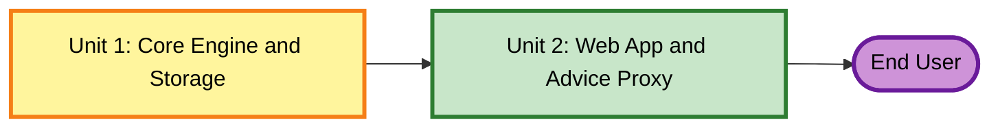

# Unit of Work Dependency — Rollover

## Dependency Matrix

| Unit | Depends On | Consumed By | Build Order |
|---|---|---|---|
| Unit 1 — Core Engine & Storage | None | Unit 2 | 1st |
| Unit 2 — Web App & Advice Proxy | Unit 1 | End user | 2nd |

No cycles, no parallel-build opportunity (Unit 2 needs Unit 1's finished, tested interface — `PlanEngine` function signatures and `StoragePort` contract — before UI/service code can be written against it meaningfully).

## Diagram



### Text Alternative
```
Unit 1 (Core Engine and Storage) --> Unit 2 (Web App and Advice Proxy) --> End User
```

## Integration Point

Unit 2 imports Unit 1's public surface directly (same repo, same TS project — no network boundary between them, only the browser↔server HTTP boundary inside Unit 2 itself, between the client services and the Express route). No versioning/contract-testing concerns beyond normal TypeScript compile-time checking.
