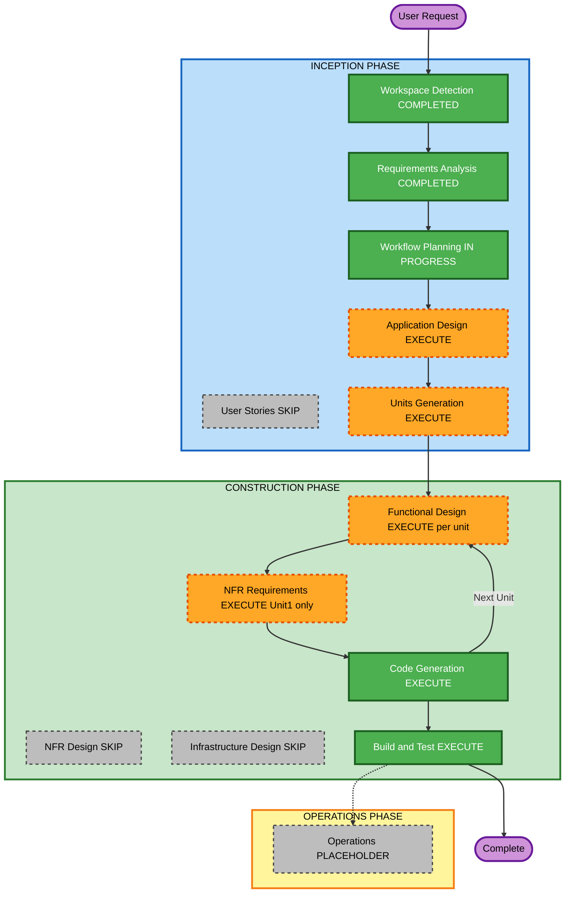

# Execution Plan — Rollover

## Detailed Analysis Summary

### Change Impact Assessment
- **User-facing changes**: Yes — entire app is new user-facing surface (setup, tracking, progress, advice).
- **Structural changes**: Yes — new app from scratch: React+TS SPA, small Node proxy server.
- **Data model changes**: Yes — new models: `FixedExpenseItem`, `ExpenseEntry`, `PlanConfig` (income/goal/cycle-start-day/currency), `AdviceResponse` (structured Gemini output).
- **API changes**: Yes — one new endpoint, `POST /api/advice`, proxying to Gemini.
- **NFR impact**: Yes — mobile-first constraints (NFR-1), storage abstraction (NFR-2), partial PBT (NFR-4).

### Risk Assessment
- **Risk Level**: Low — greenfield, single user, no production data, nothing to break.
- **Rollback Complexity**: Easy — no deployed state; local-only.
- **Testing Complexity**: Moderate — the rollover/feasibility math is the one genuinely tricky part; everything else is standard CRUD + one API call.

## Workflow Visualization



### Text Alternative
```
INCEPTION: Workspace Detection (done) -> Requirements Analysis (done) -> User Stories (SKIP)
            -> Workflow Planning (this stage) -> Application Design (EXECUTE) -> Units Generation (EXECUTE)
CONSTRUCTION: per unit [Functional Design (EXECUTE) -> NFR Requirements (Unit 1 only) -> Code Generation (ALWAYS)]
              -> Build and Test (ALWAYS)
OPERATIONS: placeholder, not entered
```

## Phases to Execute

### INCEPTION PHASE
- [x] Workspace Detection (COMPLETED)
- [x] Requirements Analysis (COMPLETED)
- [x] User Stories (SKIPPED)
  - **Rationale**: Single-user personal tool, no personas/stakeholders to reconcile; requirements.md already enumerates every screen/behavior at the story-equivalent level.
- [x] Execution Plan (this document)
- [ ] Application Design — **EXECUTE**
  - **Rationale**: Multiple new components with real boundaries (deterministic engine, storage port, advice client/proxy, UI shell) — worth 10 minutes to pin interfaces before splitting into units, so Unit 2 codes against a stable Unit 1 contract.
- [ ] Units Generation — **EXECUTE**
  - **Rationale**: Two genuinely independent layers (pure logic vs. UI+server) with a clear dependency direction — decomposing avoids a single giant code-generation pass and lets tests for the engine lock in before UI wiring.

### CONSTRUCTION PHASE (per unit)

**Unit 1 — Core Engine & Storage** (`packages/core` or `src/core`: types, plan engine, storage port + localStorage adapter)
- [ ] Functional Design — **EXECUTE** — rollover/feasibility/projection formulas need to be nailed down precisely before coding (this is the one place a mistake is expensive).
- [ ] NFR Requirements — **EXECUTE** — this is where the project's tech stack gets decided once (Vite, TS strictness, Vitest, fast-check, Node version) for the whole app, not just this unit.
- [ ] NFR Design — SKIP — no scalability/availability patterns apply to a pure in-browser module; testing approach is already captured in Functional Design + NFR Requirements.
- [ ] Infrastructure Design — SKIP — no infrastructure; runs in-browser.
- [ ] Code Generation — EXECUTE (ALWAYS)

**Unit 2 — Web App & Advice Proxy** (`src/app` UI + `server/` proxy; depends on Unit 1)
- [ ] Functional Design — **EXECUTE** (lighter) — screen/flow structure (setup → main tracker → advice panel) and the `/api/advice` request/response contract + Gemini structured-output schema.
- [ ] NFR Requirements — SKIP — stack already decided in Unit 1; mobile-first constraints are already explicit functional requirements (NFR-1), not a new tech decision.
- [ ] NFR Design — SKIP — same reason.
- [ ] Infrastructure Design — SKIP — "infrastructure" here is a single local Node process; run instructions are covered in Build and Test, not a deployment architecture.
- [ ] Code Generation — EXECUTE (ALWAYS)

- [ ] Build and Test — EXECUTE (ALWAYS)
  - **Rationale**: build instructions, unit test run (incl. partial PBT suite), and a manual mobile-viewport verification pass.

### OPERATIONS PHASE
- [ ] Operations — PLACEHOLDER (not entered this build)

## Estimated Timeline
- **Total Stages Executing**: Application Design, Units Generation, Functional Design ×2, NFR Requirements ×1, Code Generation ×2, Build and Test = 7 gated stages
- **Estimated Duration**: ~3.5h total — roughly 30–40 min INCEPTION remainder (Application Design + Units Generation), ~15 min Unit 1 design, ~2h combined code generation (engine+tests, then UI+server), ~30–45 min build/test/manual verification, remainder buffer.

## Success Criteria
- **Primary Goal**: Working Rollover app — setup, deterministic rollover budgeting, expense tracking, goal progress, Gemini-backed advice panel with graceful degradation — runnable locally.
- **Key Deliverables**: React+TS SPA, Node proxy server, unit + partial-PBT test suite for the engine, README with run instructions (incl. `GEMINI_API_KEY` / `GEMINI_MODEL` setup).
- **Quality Gates**: engine tests passing (example + property-based), mobile-viewport manual check (360–430px), AI-failure path manually verified (advice panel error state with tracking still functional).
